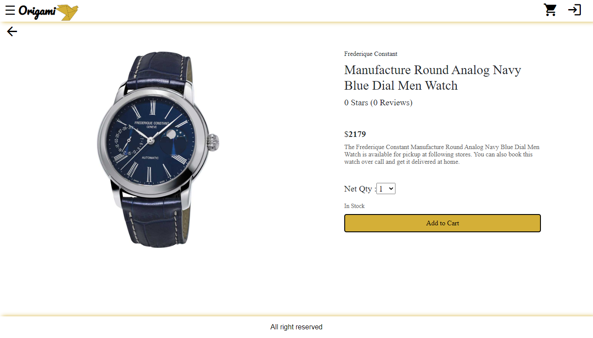
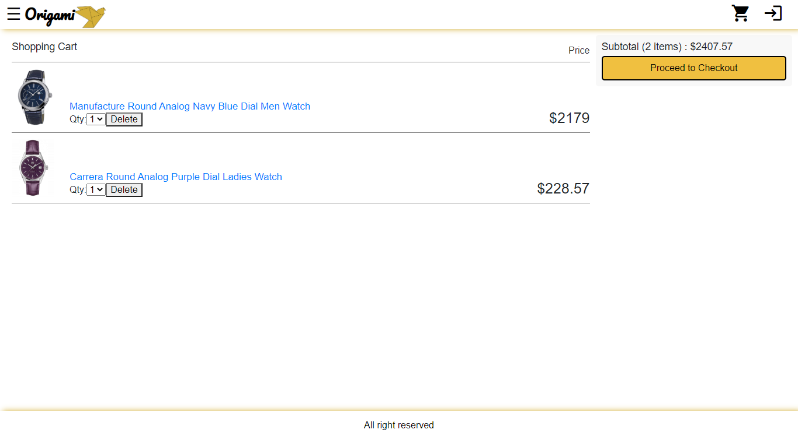
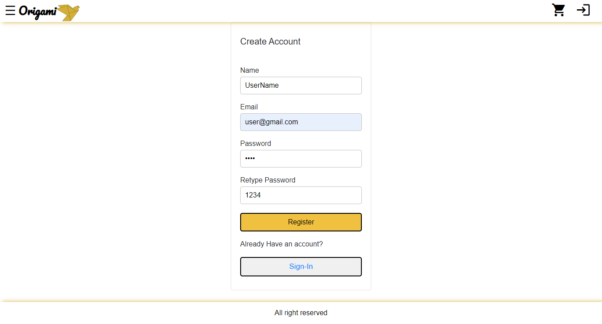
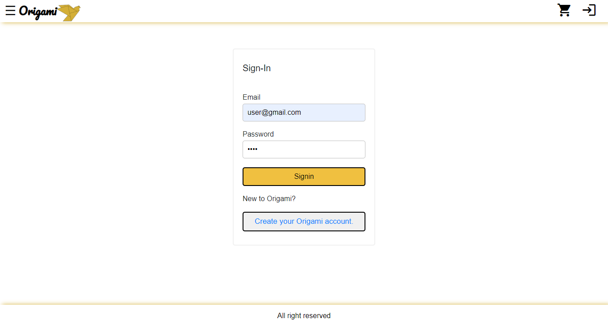
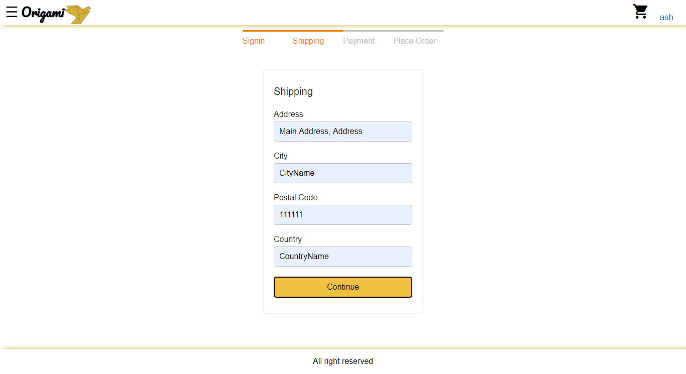
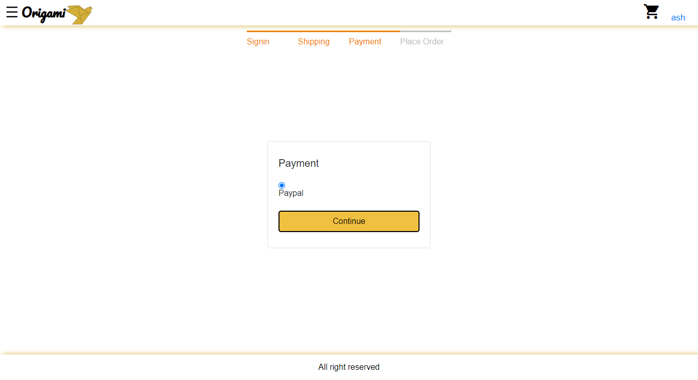
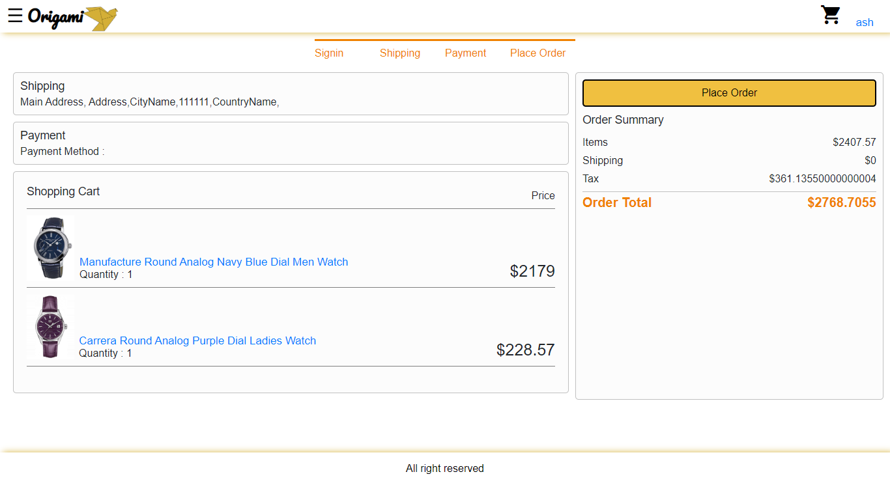
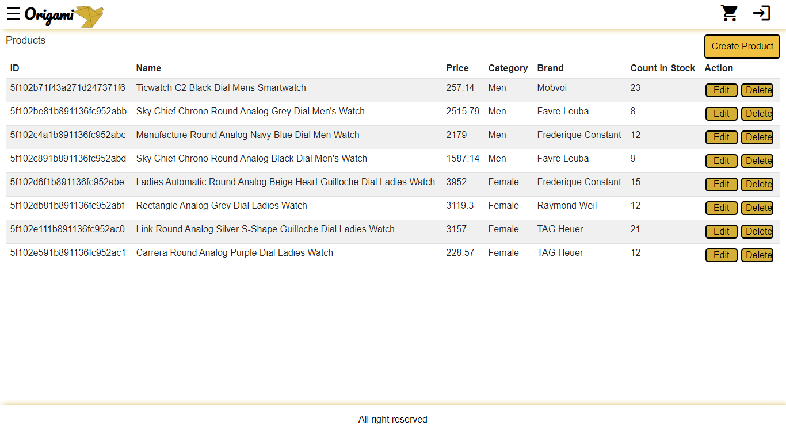
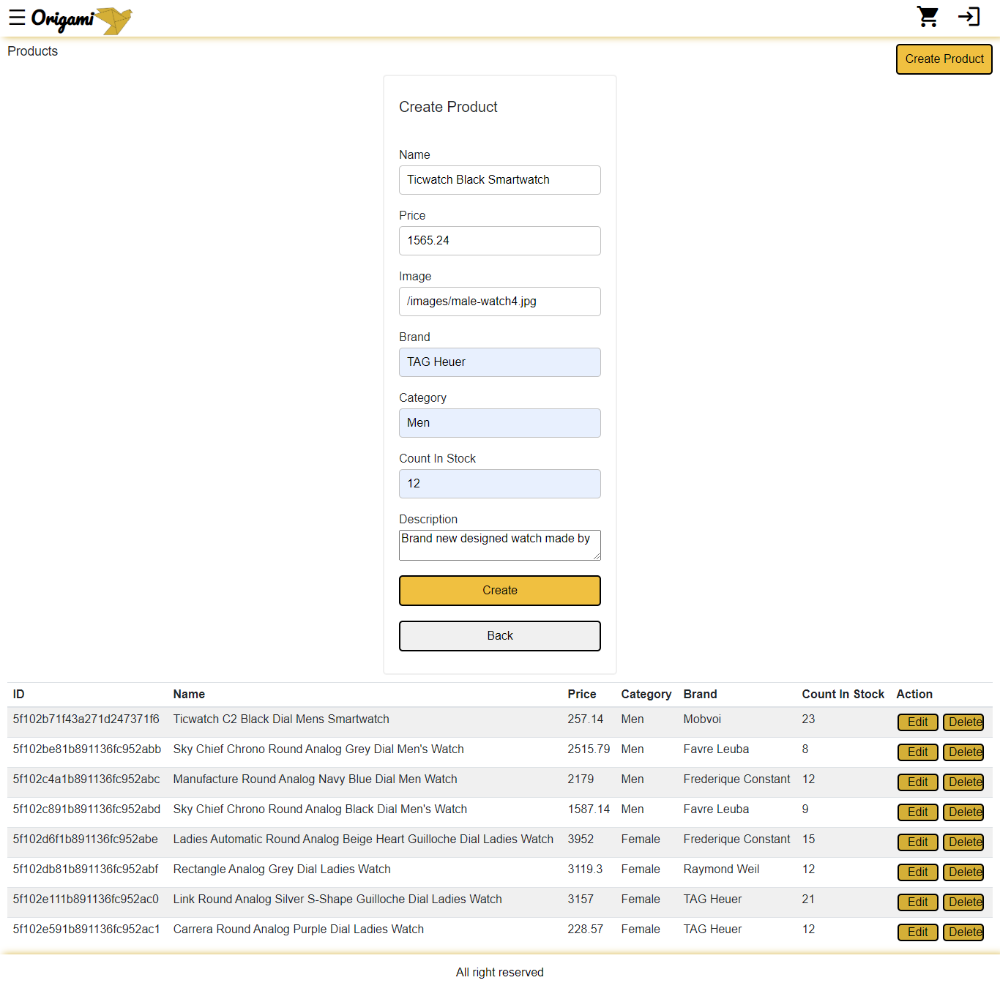

#  E-Commerce Website using MERN Stack.
A E-Commerce website developed using ReactJS for the frontend, NodeJs for the backend, MongoDB as database.

## 2026 Modernization Notes
This codebase was updated from its original 2020-era stack:
* React 16 → 18 (`createRoot`), React Router v5 → v6 (hooks: `useNavigate`, `useParams`, `useLocation`)
* Bootstrap / react-bootstrap removed entirely; UI rebuilt with Tailwind CSS
* Backend deps refreshed: Express, Mongoose 8, jsonwebtoken 9, Node >= 18
* Bug fixes: case-sensitive import crash on Linux (`userRoute.js`), duplicate `res.send()` in `productRoute.js`, wrong static-build path in `server.js`, deprecated `.remove()` → `.deleteOne()`, cart reducer dropping shipping/payment on update, broken payment-redirect check in `PlaceOrderScreen`, unmasked "retype password" field, stray `}` rendering in `ProductScreen`, missing/duplicate React `key` props, and unhelpful axios error messages
* See the assistant's chat explanation for the full list


## Table of contents
* [Prerequisites](#prerequisites)
* [Requirements](#requirements)
* [Technologies](#technologies)
* [Features](#features)
* [Screenshots](#screenshots)
* [Contact](#contact)


## Prerequisites
- Text Editor ([VS Code](https://code.visualstudio.com/download) , [Atom](https://atom.io/), [Brackets](http://brackets.io/), etc.)
- Node.js and npm - [install here](https://www.npmjs.com/get-npm)
- MongoDB - [install here](https://docs.mongodb.com/manual/installation/)


## Requirements
To run this project, install it locally using npm:

- git clone git@github.com:suhassalian27/E-Commerce-Website-using-ReactJS-NodeJS.git
```
  $ cd E-Commerce-Website-using-ReactJS-NodeJS
```
- To Run Backend
  - open terminal 
```
  $ npm install
  $ npm start
```
- To Run Frontend
  - open new terminal
```
  $ cd frontend
  $ npm install
  $ npm start
```

## Technologies
Project is created with:
* HTML5 and CSS3: Semantic Elements, Tailwind CSS
* React 18: Components, Props, Events, Hooks, React Router v6, Axios
* Redux: Store, Reducers, Actions
* Node & Express: Web API, Body Parser, JWT
* MongoDB: Mongoose
* Development: ESLint, Babel, Git, Github
* Deployment: 

## Features
List of features ready and TODOs for future development
* User Login, Signup, User Authentication.
* Admin Login.
* Add, Edit, Remove Products. (Only Admin)
* Add to Cart.

To-do list:
* Sorting
* Search

## Screenshots

### Home Page
This is the home page of e-commerce. It shows a list of products. It also uses React-Bootstrap Corousel for corousel.


________________________________________________________

### Product Details Page
When the user clicks on a product it takes you to the product details page.


________________________________________________________

### Cart
Shopping Cart is the heart of any e-commerce website. I have created a user-friendly shopping cart using React and Redux.


________________________________________________________

### Register
I have created forms for getting user info and save them in the database.


________________________________________________________

### Sign-In
Sign in page for user to sign in.


________________________________________________________

## Ordering Products

Sign in page for user to sign in.

### Shipping Screen

________________________________________________________
### Payment Screen

________________________________________________________
### Place Order Screen

________________________________________________________

### Admin 
Admin should be able to define products and update the count in stock whenever they like. This page is about managing ECommerce products.

## View Products (admin)


________________________________________________________

### Add Products (admin)


________________________________________________________


## Contact
[Suhas Suhas](https://www.suhassalian.netlify.com/) - feel free to contact me!
